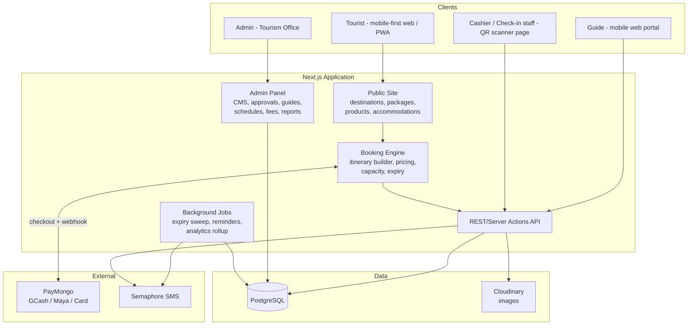
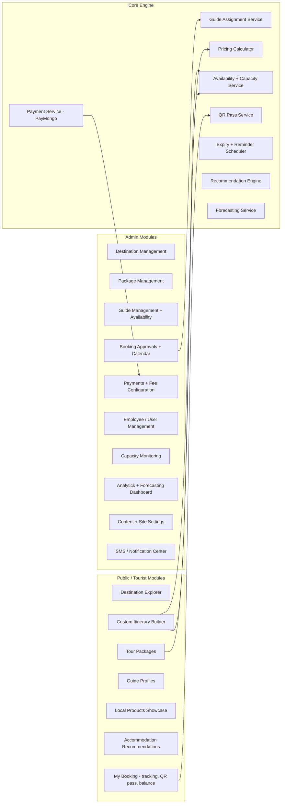

# 01 — System Architecture

## 1. Recommended Technology Stack

| Layer | Technology | Why |
|---|---|---|
| Frontend + Backend | **Next.js 15 (React, TypeScript)** — single full-stack app | One codebase for public site, tourist portal, and admin panel. Server-side rendering = fast on slow rural connections, good SEO for destination pages. |
| Database | **PostgreSQL** | Reliable, free, handles JSON fields for flexible content, window functions for analytics. |
| ORM | **Prisma** | Type-safe schema that doubles as documentation; easy migrations. |
| Styling / UI | **Tailwind CSS + shadcn/ui** | Fast to build a polished mobile-first UI and a data-dense admin dashboard. |
| Payments | **PayMongo** | One integration = GCash, Maya, cards, QR Ph — matches how Filipino tourists actually pay. Webhooks confirm payment automatically. |
| SMS | **Semaphore** (or Movider) | Cheap Philippine SMS (~₱0.50/msg). Booking confirmations, guide duty notices, payment reminders. |
| Image storage | **Cloudinary** (free tier) or S3-compatible | Automatic image resizing for slow connections. |
| Maps | **Leaflet + OpenStreetMap** | Free (no Google billing), works for destination pins and trek routes. |
| QR codes | Server-generated (e.g. `qrcode` lib), signed token | Tourist pass + guide check-in scanning via any phone camera. |
| Hosting | **Vercel + Neon/Supabase Postgres** (pilot) or a single VPS | Pilot runs comfortably on free/low tiers; VPS (~₱500/mo) if LGU requires local control. |
| Background jobs | **Vercel Cron / node-cron** | Reservation expiry sweeps, SMS reminders, daily analytics rollups. |

> **Honest note:** if the long-term maintainer after the pilot is a PHP developer, Laravel +
> Filament is an equally valid stack — every design in these documents translates directly.
> Choose based on who maintains it in year 2, not on trend.

## 2. High-Level Architecture

## 3. Application Modules

## 4. Multi-Tenant Design (Scale to Other Municipalities)

Every content table carries a `municipality_id`. A `municipalities` table stores per-LGU:

- Branding: name, logo, hero images, color theme, tagline
- Contact details, office hours
- Fee configuration (environmental fee, insurance, reservation % etc.)
- Payment mode toggles: *online (PayMongo)* and/or *reserve-online-pay-at-treasurer*
- Reservation expiry hours, approval requirements

Onboarding municipality #2 = insert one row + encode their destinations/guides. No code changes.

## 5. Payment Architecture & LGU Compliance

Two payment modes, toggleable per municipality:

1. **Online (PayMongo):** tourist pays reservation fee/down payment via GCash/Maya/card at
   checkout. PayMongo webhook marks payment `paid` → booking moves to `pending_approval`.
   Settlement goes to the LGU-registered merchant account (coordinate with the Municipal
   Treasurer — collections must be receipted per COA rules).
2. **Pay at Treasurer / on-arrival balance:** the system reserves the slot, the cashier
   records the payment in the admin panel against the booking's official receipt number.

The **remaining balance** is always payable on arrival (recorded at QR check-in), so the
online flow only ever needs to handle the reservation fee/down payment — smaller compliance
surface for the pilot.

## 6. Security Essentials

- Role-based access control: `SUPER_ADMIN`, `TOURISM_ADMIN`, `STAFF` (encoder/cashier), `GUIDE`. Only admins manage destinations, guides, employees, schedules, capacities, fees.
- Tourists book as guests (name + mobile + valid ID type) — no forced account creation; booking lookup via booking code + mobile number OTP.
- QR passes are signed tokens (HMAC) — cannot be forged or reused after completion.
- Payment amounts are always computed server-side; the client never sends prices.
- Audit log on all admin mutations (who changed the fee, who approved the booking).
- Rate limiting + OTP verification of the mobile number before a booking can be submitted (second layer of prank-booking defense on top of the reservation fee).

## 7. Offline / Low-Bandwidth Considerations

- PWA with cached destination pages; images served resized via Cloudinary.
- QR pass is downloadable/saved to phone — check-in scanning works even if the tourist has no signal at the site (staff device validates the signed token, syncs later).
- SMS (not email) is the primary notification channel.
