# 02 — Database Design

PostgreSQL. Every domain table carries `municipality_id` for multi-tenancy (omitted from the
ERD below for readability).

## 1. Entity-Relationship Diagram

```mermaid
erDiagram
    MUNICIPALITIES ||--o{ DESTINATIONS : has
    MUNICIPALITIES ||--o{ TOUR_GUIDES : accredits
    MUNICIPALITIES ||--o{ TOUR_PACKAGES : offers
    MUNICIPALITIES ||--o{ USERS : employs
    MUNICIPALITIES ||--o{ FEE_SETTINGS : configures

    DESTINATIONS ||--o{ DESTINATION_IMAGES : has
    DESTINATIONS ||--o{ DESTINATION_CLOSURES : "blackout dates"
    DESTINATIONS ||--o{ PACKAGE_DESTINATIONS : "included in"
    DESTINATIONS ||--o{ BOOKING_DESTINATIONS : "visited in"

    TOUR_PACKAGES ||--o{ PACKAGE_DESTINATIONS : includes
    TOUR_PACKAGES ||--o{ PACKAGE_INCLUSIONS : lists
    TOUR_PACKAGES ||--o{ PACKAGE_IMAGES : has
    TOUR_PACKAGES ||--o{ BOOKINGS : "booked as"

    TOUR_GUIDES ||--o{ GUIDE_CERTIFICATIONS : holds
    TOUR_GUIDES ||--o{ GUIDE_AVAILABILITY : declares
    TOUR_GUIDES ||--o{ GUIDE_ASSIGNMENTS : "assigned via"
    TOUR_GUIDES ||--o{ REVIEWS : receives

    BOOKINGS ||--o{ BOOKING_DESTINATIONS : "itinerary items"
    BOOKINGS ||--o{ BOOKING_FEES : "cost breakdown"
    BOOKINGS ||--o{ PAYMENTS : "paid by"
    BOOKINGS ||--o{ GUIDE_ASSIGNMENTS : "guided by"
    BOOKINGS ||--|| QR_PASSES : issues
    BOOKINGS ||--o{ BOOKING_STATUS_LOGS : tracks
    BOOKINGS ||--o{ REVIEWS : "rated via"
    BOOKINGS ||--o{ SMS_LOGS : notifies

    USERS ||--o{ BOOKING_STATUS_LOGS : "acted by"
    MUNICIPALITIES ||--o{ LOCAL_PRODUCTS : showcases
    MUNICIPALITIES ||--o{ ACCOMMODATIONS : recommends
    MUNICIPALITIES ||--o{ TRANSPORT_ROUTES : prices
```



## 2. Table Definitions (SQL DDL)

```sql
-- ============ TENANCY & USERS ============

CREATE TABLE municipalities (
    municipality_id   SERIAL PRIMARY KEY,
    name              VARCHAR(120) NOT NULL,            -- 'Bagulin'
    province          VARCHAR(120) NOT NULL,            -- 'La Union'
    tagline           VARCHAR(255),                     -- 'Highlands of La Union'
    logo_url          TEXT,
    hero_image_url    TEXT,
    theme_color       VARCHAR(7) DEFAULT '#1B5E20',
    contact_number    VARCHAR(20),
    email             VARCHAR(120),
    address           TEXT,
    online_payment_enabled  BOOLEAN DEFAULT TRUE,
    treasurer_payment_enabled BOOLEAN DEFAULT TRUE,
    reservation_expiry_hours INT DEFAULT 24,
    status            VARCHAR(20) DEFAULT 'active'
);

CREATE TABLE users (                                    -- admins, staff, guides' logins
    user_id           SERIAL PRIMARY KEY,
    municipality_id   INT NOT NULL REFERENCES municipalities,
    full_name         VARCHAR(150) NOT NULL,
    email             VARCHAR(150) UNIQUE,
    mobile            VARCHAR(20),
    password_hash     TEXT NOT NULL,
    role              VARCHAR(20) NOT NULL CHECK (role IN
                        ('SUPER_ADMIN','TOURISM_ADMIN','STAFF','GUIDE')),
    guide_id          INT NULL,                         -- link when role = GUIDE
    status            VARCHAR(20) DEFAULT 'active',
    created_at        TIMESTAMPTZ DEFAULT now()
);

CREATE TABLE audit_logs (
    log_id            BIGSERIAL PRIMARY KEY,
    user_id           INT REFERENCES users,
    action            VARCHAR(60) NOT NULL,             -- 'UPDATE_FEE', 'APPROVE_BOOKING'
    entity            VARCHAR(60),
    entity_id         TEXT,
    details           JSONB,
    created_at        TIMESTAMPTZ DEFAULT now()
);

-- ============ DESTINATIONS ============

CREATE TABLE destinations (
    destination_id    SERIAL PRIMARY KEY,
    municipality_id   INT NOT NULL REFERENCES municipalities,
    destination_name  VARCHAR(150) NOT NULL,
    barangay          VARCHAR(100) NOT NULL,
    category          VARCHAR(50) NOT NULL,             -- Waterfall, Cave, Viewpoint, Landmark, Park
    description       TEXT,
    activities        TEXT[],                           -- {Swimming, Trekking, Photography}
    trekking_duration VARCHAR(50),                      -- '15-20 minutes'
    difficulty        VARCHAR(20) DEFAULT 'easy',       -- easy | moderate | challenging
    guide_required    BOOLEAN DEFAULT FALSE,
    entrance_fee      NUMERIC(10,2) DEFAULT 0,          -- per pax
    environmental_fee NUMERIC(10,2) DEFAULT 0,          -- per pax (ordinance-based, overrides default)
    daily_capacity    INT NOT NULL DEFAULT 50,          -- max visitors per day
    open_time         TIME DEFAULT '07:00',
    close_time        TIME DEFAULT '17:00',
    latitude          NUMERIC(10,7),
    longitude         NUMERIC(10,7),
    main_image        TEXT,
    what_to_bring     TEXT,
    safety_notes      TEXT,
    status            VARCHAR(20) DEFAULT 'active',     -- active | inactive | maintenance
    created_at        TIMESTAMPTZ DEFAULT now()
);

CREATE TABLE destination_images (
    image_id          SERIAL PRIMARY KEY,
    destination_id    INT NOT NULL REFERENCES destinations ON DELETE CASCADE,
    image_url         TEXT NOT NULL,
    caption           VARCHAR(255),
    sort_order        INT DEFAULT 0
);

CREATE TABLE destination_closures (                     -- typhoon days, maintenance, fiestas
    closure_id        SERIAL PRIMARY KEY,
    destination_id    INT NOT NULL REFERENCES destinations ON DELETE CASCADE,
    closure_date      DATE NOT NULL,
    reason            VARCHAR(255),
    UNIQUE (destination_id, closure_date)
);

-- ============ TOUR GUIDES ============

CREATE TABLE tour_guides (
    guide_id          SERIAL PRIMARY KEY,
    municipality_id   INT NOT NULL REFERENCES municipalities,
    full_name         VARCHAR(150) NOT NULL,
    barangay          VARCHAR(100) NOT NULL,
    mobile            VARCHAR(20),
    photo_url         TEXT,
    bio               TEXT,
    years_experience  INT DEFAULT 0,
    specialties       TEXT[],                           -- {Rappelling, Cave Tours, First Aid}
    daily_rate        NUMERIC(10,2) NOT NULL DEFAULT 500,  -- guide fee per day per group
    max_group_size    INT DEFAULT 10,                   -- pax one guide can handle
    rating_avg        NUMERIC(3,2) DEFAULT 0,
    rating_count      INT DEFAULT 0,
    accreditation_no  VARCHAR(60),
    status            VARCHAR(20) DEFAULT 'active',     -- active | inactive | suspended
    created_at        TIMESTAMPTZ DEFAULT now()
);

CREATE TABLE guide_certifications (
    cert_id           SERIAL PRIMARY KEY,
    guide_id          INT NOT NULL REFERENCES tour_guides ON DELETE CASCADE,
    title             VARCHAR(150) NOT NULL,            -- 'DOT Community Guide Training'
    issuer            VARCHAR(150),
    issued_date       DATE,
    expiry_date       DATE,
    certificate_url   TEXT
);

CREATE TABLE guide_availability (                       -- guide-declared or admin-set
    availability_id   SERIAL PRIMARY KEY,
    guide_id          INT NOT NULL REFERENCES tour_guides ON DELETE CASCADE,
    date              DATE NOT NULL,
    status            VARCHAR(20) NOT NULL DEFAULT 'available',
                      -- available | unavailable  (assigned = derived from guide_assignments)
    note              VARCHAR(255),
    UNIQUE (guide_id, date)
);

-- ============ TOUR PACKAGES ============

CREATE TABLE tour_packages (
    package_id        SERIAL PRIMARY KEY,
    municipality_id   INT NOT NULL REFERENCES municipalities,
    package_name      VARCHAR(150) NOT NULL,
    slug              VARCHAR(160) UNIQUE,
    description       TEXT,
    duration_days     INT DEFAULT 1,
    duration_label    VARCHAR(50),                      -- 'Full day (8 hrs)'
    price_per_pax     NUMERIC(10,2) NOT NULL,
    min_pax           INT DEFAULT 1,
    max_pax           INT NOT NULL,                     -- package capacity per date
    main_image        TEXT,
    itinerary_notes   TEXT,                             -- hour-by-hour plan
    status            VARCHAR(20) DEFAULT 'active',
    created_at        TIMESTAMPTZ DEFAULT now()
);

CREATE TABLE package_destinations (
    package_id        INT NOT NULL REFERENCES tour_packages ON DELETE CASCADE,
    destination_id    INT NOT NULL REFERENCES destinations,
    visit_order       INT NOT NULL,
    PRIMARY KEY (package_id, destination_id)
);

CREATE TABLE package_inclusions (
    inclusion_id      SERIAL PRIMARY KEY,
    package_id        INT NOT NULL REFERENCES tour_packages ON DELETE CASCADE,
    label             VARCHAR(150) NOT NULL,            -- 'Tour guide', 'Habal-habal transport', 'Insurance'
    included          BOOLEAN DEFAULT TRUE              -- FALSE = listed as exclusion
);

CREATE TABLE package_images (
    image_id          SERIAL PRIMARY KEY,
    package_id        INT NOT NULL REFERENCES tour_packages ON DELETE CASCADE,
    image_url         TEXT NOT NULL,
    sort_order        INT DEFAULT 0
);

-- ============ FEES & TRANSPORT ============

CREATE TABLE fee_settings (                             -- municipality-level defaults
    fee_id            SERIAL PRIMARY KEY,
    municipality_id   INT NOT NULL REFERENCES municipalities,
    fee_code          VARCHAR(40) NOT NULL,             -- ENVIRONMENTAL | INSURANCE | RESERVATION
    label             VARCHAR(100) NOT NULL,
    calc_type         VARCHAR(20) NOT NULL,             -- per_pax | per_booking | percent_of_total
    amount            NUMERIC(10,2) NOT NULL,           -- peso amount, or percent value
    is_active         BOOLEAN DEFAULT TRUE,
    UNIQUE (municipality_id, fee_code)
);

CREATE TABLE transport_routes (                         -- optional transport add-on pricing
    route_id          SERIAL PRIMARY KEY,
    municipality_id   INT NOT NULL REFERENCES municipalities,
    route_name        VARCHAR(150) NOT NULL,            -- 'Town Proper ↔ Brgy. Suyo'
    vehicle_type      VARCHAR(50),                      -- 'Habal-habal', 'Van', 'Jeepney'
    fee_per_pax       NUMERIC(10,2),
    fee_per_trip      NUMERIC(10,2),
    max_pax_per_trip  INT,
    is_active         BOOLEAN DEFAULT TRUE
);

-- ============ BOOKINGS ============

CREATE TABLE bookings (
    booking_id        SERIAL PRIMARY KEY,
    booking_code      VARCHAR(12) UNIQUE NOT NULL,      -- 'BGL-8F3K2A'
    municipality_id   INT NOT NULL REFERENCES municipalities,
    booking_type      VARCHAR(10) NOT NULL CHECK (booking_type IN ('custom','package')),
    package_id        INT NULL REFERENCES tour_packages,
    -- lead tourist (guest checkout, OTP-verified mobile)
    tourist_name      VARCHAR(150) NOT NULL,
    tourist_mobile    VARCHAR(20) NOT NULL,
    tourist_email     VARCHAR(150),
    tourist_origin    VARCHAR(150),                     -- city/province — feeds DOT arrival reports
    tourist_country   VARCHAR(100) DEFAULT 'Philippines',
    valid_id_type     VARCHAR(50),
    pax_adults        INT NOT NULL DEFAULT 1,
    pax_children      INT NOT NULL DEFAULT 0,
    visit_date        DATE NOT NULL,
    duration_days     INT DEFAULT 1,
    needs_transport   BOOLEAN DEFAULT FALSE,
    transport_route_id INT NULL REFERENCES transport_routes,
    special_requests  TEXT,
    -- money (all amounts computed server-side, denormalized for receipts)
    total_amount      NUMERIC(12,2) NOT NULL,
    reservation_due   NUMERIC(12,2) NOT NULL,           -- required to confirm
    amount_paid       NUMERIC(12,2) NOT NULL DEFAULT 0,
    balance           NUMERIC(12,2) GENERATED ALWAYS AS (total_amount - amount_paid) STORED,
    -- lifecycle
    status            VARCHAR(20) NOT NULL DEFAULT 'pending_payment' CHECK (status IN
                      ('pending_payment',   -- submitted, awaiting reservation fee
                       'pending_approval',  -- fee paid, awaiting tourism office review
                       'approved',          -- guide assigned, QR pass issued
                       'checked_in',        -- QR scanned on arrival, balance settled
                       'completed',         -- visit finished
                       'cancelled',
                       'expired')),         -- reservation fee not paid in time
    expires_at        TIMESTAMPTZ,                      -- set on creation
    approved_by       INT REFERENCES users,
    approved_at       TIMESTAMPTZ,
    cancel_reason     TEXT,
    created_at        TIMESTAMPTZ DEFAULT now()
);

CREATE TABLE booking_destinations (                     -- the itinerary (custom or copied from package)
    booking_id        INT NOT NULL REFERENCES bookings ON DELETE CASCADE,
    destination_id    INT NOT NULL REFERENCES destinations,
    visit_order       INT NOT NULL,
    visit_date        DATE NOT NULL,                    -- supports multi-day itineraries
    PRIMARY KEY (booking_id, destination_id, visit_date)
);

CREATE TABLE booking_fees (                             -- the full cost breakdown, line by line
    fee_line_id       SERIAL PRIMARY KEY,
    booking_id        INT NOT NULL REFERENCES bookings ON DELETE CASCADE,
    fee_code          VARCHAR(40) NOT NULL,             -- ENTRANCE | ENVIRONMENTAL | GUIDE | TRANSPORT | INSURANCE
    label             VARCHAR(150) NOT NULL,            -- 'Entrance — Bulalakaw Falls'
    quantity          INT NOT NULL DEFAULT 1,           -- usually pax count or days
    unit_amount       NUMERIC(10,2) NOT NULL,
    line_total        NUMERIC(12,2) NOT NULL
);

CREATE TABLE guide_assignments (
    assignment_id     SERIAL PRIMARY KEY,
    booking_id        INT NOT NULL REFERENCES bookings ON DELETE CASCADE,
    guide_id          INT NOT NULL REFERENCES tour_guides,
    duty_date         DATE NOT NULL,
    status            VARCHAR(20) DEFAULT 'assigned',   -- assigned | notified | confirmed | completed | declined
    notified_at       TIMESTAMPTZ,
    UNIQUE (guide_id, duty_date, booking_id)
);

CREATE TABLE booking_status_logs (
    log_id            BIGSERIAL PRIMARY KEY,
    booking_id        INT NOT NULL REFERENCES bookings ON DELETE CASCADE,
    from_status       VARCHAR(20),
    to_status         VARCHAR(20) NOT NULL,
    actor_user_id     INT REFERENCES users,             -- NULL = system/tourist
    note              TEXT,
    created_at        TIMESTAMPTZ DEFAULT now()
);

-- ============ PAYMENTS ============

CREATE TABLE payments (
    payment_id        SERIAL PRIMARY KEY,
    booking_id        INT NOT NULL REFERENCES bookings,
    payment_kind      VARCHAR(20) NOT NULL,             -- reservation | downpayment | balance
    method            VARCHAR(20) NOT NULL,             -- gcash | maya | card | treasurer_cash
    amount            NUMERIC(12,2) NOT NULL,
    gateway_ref       VARCHAR(100),                     -- PayMongo payment intent id
    or_number         VARCHAR(60),                      -- official receipt no. (treasurer payments)
    status            VARCHAR(20) NOT NULL DEFAULT 'pending', -- pending | paid | failed | refunded
    paid_at           TIMESTAMPTZ,
    recorded_by       INT REFERENCES users,             -- cashier, for manual entries
    created_at        TIMESTAMPTZ DEFAULT now()
);

-- ============ QR PASSES & NOTIFICATIONS ============

CREATE TABLE qr_passes (
    pass_id           SERIAL PRIMARY KEY,
    booking_id        INT UNIQUE NOT NULL REFERENCES bookings,
    token             TEXT UNIQUE NOT NULL,             -- signed HMAC token embedded in QR
    issued_at         TIMESTAMPTZ DEFAULT now(),
    scanned_at        TIMESTAMPTZ,
    scanned_by        INT REFERENCES users
);

CREATE TABLE sms_logs (
    sms_id            BIGSERIAL PRIMARY KEY,
    booking_id        INT REFERENCES bookings,
    recipient_mobile  VARCHAR(20) NOT NULL,
    recipient_type    VARCHAR(20) NOT NULL,             -- tourist | guide | admin
    template          VARCHAR(60) NOT NULL,             -- BOOKING_CONFIRMED, GUIDE_DUTY, EXPIRY_WARNING...
    message           TEXT NOT NULL,
    status            VARCHAR(20) DEFAULT 'queued',     -- queued | sent | failed
    sent_at           TIMESTAMPTZ
);

-- ============ REVIEWS ============

CREATE TABLE reviews (
    review_id         SERIAL PRIMARY KEY,
    booking_id        INT NOT NULL REFERENCES bookings,
    guide_id          INT REFERENCES tour_guides,
    destination_id    INT REFERENCES destinations,
    rating            INT NOT NULL CHECK (rating BETWEEN 1 AND 5),
    comment           TEXT,
    created_at        TIMESTAMPTZ DEFAULT now()
);

-- ============ SHOWCASE (NON-BOOKABLE) ============

CREATE TABLE local_products (
    product_id        SERIAL PRIMARY KEY,
    municipality_id   INT NOT NULL REFERENCES municipalities,
    product_name      VARCHAR(150) NOT NULL,
    category          VARCHAR(50),
    description       TEXT,
    producer          VARCHAR(150),
    where_to_buy      VARCHAR(255),
    image             TEXT,
    status            VARCHAR(20) DEFAULT 'available'
);

CREATE TABLE accommodations (                           -- RECOMMENDATIONS ONLY — never in payment flow
    accommodation_id  SERIAL PRIMARY KEY,
    municipality_id   INT NOT NULL REFERENCES municipalities,
    name              VARCHAR(150) NOT NULL,
    type              VARCHAR(30) NOT NULL,             -- homestay | cottage | inn
    barangay          VARCHAR(100),
    description       TEXT,
    contact_person    VARCHAR(150),
    contact_number    VARCHAR(20),
    price_range       VARCHAR(60),                      -- '₱500–₱1,500 / night'
    image             TEXT,
    status            VARCHAR(20) DEFAULT 'active'
);

-- ============ ANALYTICS SUPPORT ============

CREATE TABLE daily_visitor_stats (                      -- nightly rollup job
    stat_date         DATE NOT NULL,
    municipality_id   INT NOT NULL REFERENCES municipalities,
    destination_id    INT REFERENCES destinations,
    visitors          INT DEFAULT 0,
    bookings          INT DEFAULT 0,
    revenue           NUMERIC(12,2) DEFAULT 0,
    PRIMARY KEY (stat_date, municipality_id, destination_id)
);

-- key indexes
CREATE INDEX idx_bookings_visit_date  ON bookings (municipality_id, visit_date, status);
CREATE INDEX idx_bookings_expiry      ON bookings (status, expires_at) WHERE status = 'pending_payment';
CREATE INDEX idx_assignments_duty     ON guide_assignments (guide_id, duty_date);
CREATE INDEX idx_bd_capacity          ON booking_destinations (destination_id, visit_date);
```

## 3. Capacity Rule (How Availability Is Computed)

For a destination `D` on date `X`:

```
used = SUM(pax_adults + pax_children) of bookings joined via booking_destinations
       WHERE destination_id = D AND visit_date = X
       AND status IN ('pending_payment'*, 'pending_approval', 'approved', 'checked_in')
remaining = destinations.daily_capacity - used
```

\* `pending_payment` bookings hold their slots **only until `expires_at`** — the expiry job
releases them, so unpaid reservations can never block real tourists for more than the
configured window (default 24 h). Packages additionally enforce `tour_packages.max_pax` per date.

## 4. Seed Data (Bagulin Pilot)

```sql
INSERT INTO municipalities (name, province, tagline) VALUES
('Bagulin', 'La Union', 'Highlands of La Union');

-- Default fees (amounts are placeholders — set per municipal ordinance)
INSERT INTO fee_settings (municipality_id, fee_code, label, calc_type, amount) VALUES
(1,'ENVIRONMENTAL','Environmental Fee','per_pax',30.00),
(1,'INSURANCE','Tourist Insurance','per_pax',25.00),
(1,'RESERVATION','Reservation Fee','percent_of_total',20.00);

INSERT INTO destinations
(municipality_id, destination_name, barangay, category, description, activities,
 trekking_duration, difficulty, guide_required, daily_capacity) VALUES
(1,'Kudlap Burial Cave','Cambaly','Heritage Cave',
 'Features ancient artifacts, declared as a National Cultural Treasure, and preserves the rich cultural heritage of the municipality.',
 '{Cultural tour,Heritage exploration,Historical sightseeing}',NULL,'moderate',TRUE,30),
(1,'Kudal People''s Park','Tagudtud','Park',
 'Known as the "Little Baguio" of Bagulin. Offers visitors cool pine breezes and overlooking views of the West Philippine Sea.',
 '{Sightseeing,Photography,Relaxation}',NULL,'easy',FALSE,100),
(1,'Tiluniang Falls','Cardiz','Waterfall',
 'Offers a great picnic area and enjoyable dips in its rushing clear waters and natural pools.',
 '{Swimming,Picnic,Nature trekking}',NULL,'easy',TRUE,60),
(1,'Picao Hanging Footbridge','Suyo','Landmark',
 'The longest hanging footbridge in La Union — approximately 211.30 m long, 1.30 m wide, standing 5 m above the Bagulin River.',
 '{Sightseeing,Photography,Walking tour}',NULL,'easy',FALSE,80),
(1,'Loslosi Falls','Suyo','Waterfall',
 'Majestic waterfalls with multiple cascades and natural pools suitable for swimming and picnics.',
 '{Swimming,Picnic,Nature exploration}',NULL,'easy',TRUE,60),
(1,'Bulalakaw Falls','Alibangsay','Waterfall',
 'Crystal-clear waterfalls that entice visitors to swim. Requires approximately 15–20 minutes of trekking.',
 '{Trekking,Swimming,Photography}','15-20 minutes','moderate',TRUE,50),
(1,'Kudlap Viewdeck','Cambaly','Viewpoint',
 'Panoramic views of mountains, rice terraces, boyboy (tiger grass) farms, and neighboring municipalities.',
 '{Viewing,Photography,Sightseeing}',NULL,'easy',FALSE,80),
(1,'Kapandagan Falls','Cardiz','Adventure Waterfall',
 'Requires approximately 40 minutes of trekking with rappelling assistance from trained tour guides. Crystal-clear waters and scenic waterfalls.',
 '{Trekking,Rappelling,Swimming,Adventure tourism}','40 minutes','challenging',TRUE,30);

INSERT INTO tour_guides (municipality_id, full_name, barangay) VALUES
(1,'Dwaynver B. Abangley','Tagudtud'),
(1,'Jerald Tuaban','Cardiz'),
(1,'Danilo Pulmano','Alibangsay'),
(1,'Ofelia Rodriguez','Cardiz'),
(1,'Greg Galate','Cardiz'),
(1,'Elmer Atimpao','Cardiz'),
(1,'Eliazer Simeon','Baay'),
(1,'Jasmin S. Fernandez','Baay'),
(1,'Joen Compas','Tagudtud'),
(1,'Joneflord D. Flores','Alibangsay'),
(1,'Venus A. Dangpilen','Suyo'),
(1,'Edison Edzel D. Caluza','Suyo'),
(1,'Hazel B. Villano','Cambaly'),
(1,'May Ann Galate','Cardiz'),
(1,'Erma E. Soriano','Suyo'),
(1,'Mildred Caluza','Suyo'),
(1,'Cristian Munar','Alibangsay'),
(1,'Prescila Calis','Cardiz'),
(1,'Dionie Lubrica','Suyo'),
(1,'Yolanda S. Ofo-ob','Cambaly'),
(1,'Dexter B. Batatas','Cambaly'),
(1,'Jayson L. Alos','Suyo');

INSERT INTO local_products (municipality_id, product_name, category, description, producer) VALUES
(1,'Quality Softbrooms','Handicraft',
 'Main product of the municipality. Made from locally planted and harvested raw materials and handcrafted by local farmers.','Local Farmers'),
(1,'Bugnay Wine','Beverage',
 'Bagulin''s locally produced wine made from bugnay berries harvested within the municipality.','Local Producers'),
(1,'Organic Turmeric-Ginger Tea / Powder','Food',
 'Produced by Bagulin Multi-Purpose Cooperative in partnership with LGU Bagulin, DTI, and BFAD.','Bagulin Multi-Purpose Cooperative'),
(1,'Ube Wine','Beverage',
 'Bagulin''s locally produced wine made from locally harvested ube. Supports local farmers and the local economy.','Local Farmers');
```

## 5. Smart Guide-Assignment Heuristic

When a booking reaches `pending_approval`, the system ranks available guides and suggests
the best match to the admin (admin confirms — assignment stays mandatory and human-approved):

1. **Availability** — no `guide_assignments` on the duty date, not marked `unavailable`.
2. **Barangay proximity** — guide's barangay matches an itinerary destination's barangay
   (a Cardiz guide for Kapandagan Falls; Suyo guide for Loslosi/Picao).
3. **Specialty match** — Kapandagan requires a rappelling-certified guide; Kudlap Burial
   Cave prefers heritage/cultural specialty.
4. **Fair rotation** — fewest assignments in the last 30 days first, so duty (and income)
   spreads fairly across all 22 guides. This matters for community buy-in.
5. **Rating** — tiebreaker.

One guide per `max_group_size` pax; larger groups auto-suggest multiple guides.
