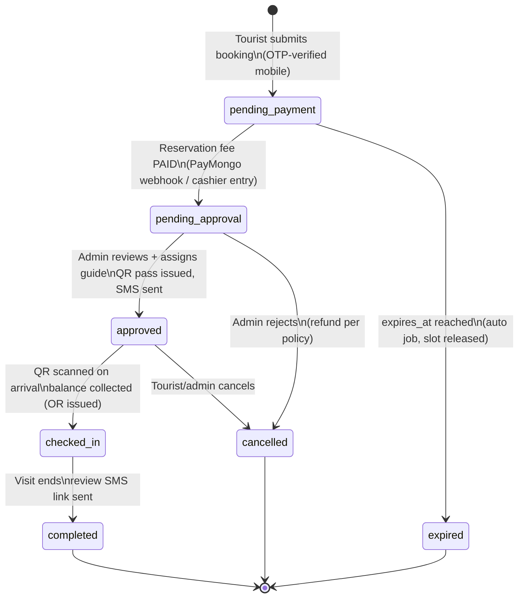
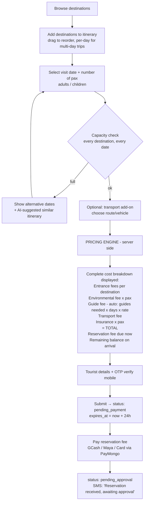
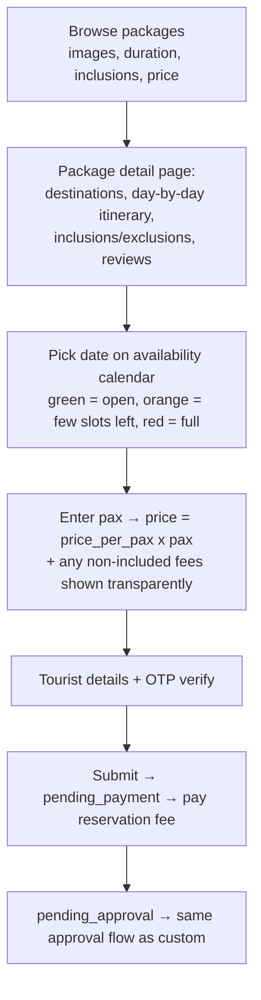
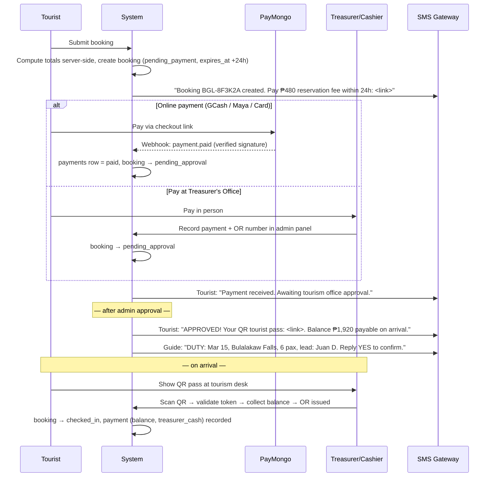
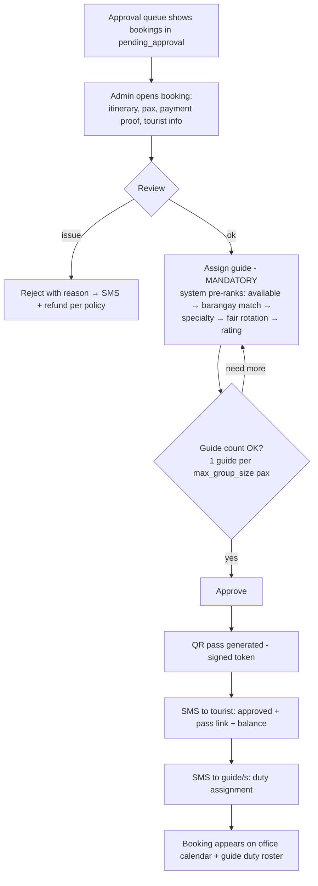
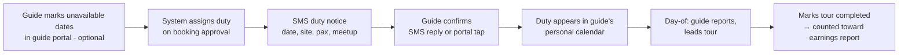

# 03 — Workflows & Booking Process

## 1. Booking Lifecycle (State Machine)

**Anti-prank design:** a booking holds capacity only while `pending_payment` (max = expiry
window, default 24 h) and is never visible to guides or counted as a real arrival until the
reservation fee is actually paid. OTP verification of the mobile number blocks bulk fake
submissions before that.

## 2. Method 1 — Custom Itinerary Builder

**Pricing engine rules (all server-side):**

| Fee | Calculation |
|---|---|
| Entrance | Σ per destination: `entrance_fee × pax` |
| Environmental | `env_fee × pax` (destination override, else municipal default) |
| Guide | `ceil(pax / max_group_size) × daily_rate × duration_days` — only if any destination has `guide_required = TRUE` (guide is still mandatorily *assigned* for all bookings; fee applies when guiding service is required) |
| Transport | route `fee_per_pax × pax` or `fee_per_trip × trips needed` |
| Insurance | `insurance_fee × pax × duration_days` |
| **Total** | sum of the above |
| Reservation fee | `percent_of_total` (e.g. 20%) or fixed amount — per fee_settings |
| Remaining balance | `total − amount_paid`, collected at check-in with official receipt |

Every line is stored in `booking_fees`, so the tourist's breakdown, the admin's view, and
the treasurer's report always agree.

## 3. Method 2 — Official Tour Package Booking

## 4. Payment Flow

**Reminder schedule (background jobs):**
- T+12h unpaid → SMS warning "12 hours left to pay"
- `expires_at` reached → booking `expired`, capacity released, SMS notice
- Visit-date −2 days → SMS reminder to tourist (what to bring, meetup point) and duty reminder to guide
- Visit-date +1 day, status completed → SMS with review link

## 5. Booking Approval Workflow (Admin)

## 6. Day-of-Visit: QR Check-in

1. Tourist arrives at the Tourism Office desk (or destination entry point) and shows the QR pass (screenshot works — no signal needed).
2. Staff scans with any phone via the admin scanner page → system validates the signed token, shows booking summary + **remaining balance due**.
3. Cashier collects balance, enters OR number → booking `checked_in`.
4. Assigned guide meets the group (guide confirmed duty via SMS reply / guide portal).
5. After the tour, guide or staff marks `completed` → visitor counted in analytics → review SMS sent.

**Edge cases handled:** re-scan of a used pass shows "already checked in"; scan of an
expired/cancelled booking shows red "INVALID" with reason; no-shows auto-flagged if not
checked in by close time (reservation fee forfeited per policy — configurable).

## 7. Guide Duty Cycle (Solves the Core Problem)

Guides only ever travel to a site when there is a **paid, approved booking** — no more
reporting for duty on days nobody comes, and no tourists arriving with no guide present.
The admin dashboard shows a **duty roster per day**; each guide's portal shows earnings
history (assignments × daily rate) — useful for their own records and LGU honoraria processing.
